# Plum AI OPD Claim Adjudicator

An intelligent, full-stack automation tool designed to streamline Outpatient Department (OPD) insurance claim processing. This system uses OCR and LLM reasoning to adjudicate claims against policy terms in seconds.

## Live Demo & Links
- **Live Demo:** https://plum-final.vercel.app/

## System Architecture


## Features
- **AI-Powered Adjudication:** Uses Groq (Llama 3.3 70B) to analyze medical necessity and policy limits.
- **OCR Integration:** Tesseract-powered extraction of text from medical bills and prescriptions.
- **Midnight Operations Dashboard:** A professional dark-themed command center for claims managers.
- **Human-in-the-Loop:** Admin interface to review AI logic, detect fraud flags, and manually override decisions.
- **One-Click Reports:** Generates professional PDF adjudication reports for claimants.
- **Real-time AI Chat:** A "Care Navigator" chatbot that explains specific policy rejections to users.

## Tech Stack
- **Frontend:** Next.js 14, TypeScript, Tailwind CSS, Shadcn/UI
- **Backend:** Python FastAPI
- **Database/Auth:** Supabase (PostgreSQL & Storage)
- **AI/LLM:** Groq (Llama 3.3 70B)
- **OCR Engine:** Tesseract OCR

## Setup Instructions

### Prerequisites
- Python 3.10+
- Node.js 18+
- **Tesseract OCR:** [Download here](https://github.com/UB-Mannheim/tesseract/wiki). Ensure it's installed at `C:\Program Files\Tesseract-OCR\tesseract.exe` (Windows).

### Backend Setup
1. Navigate to `/backend`
2. Create a `.env` file with:
   ```env
   GROQ_API_KEY=your_key
   SUPABASE_URL=your_url
   SUPABASE_ANON_KEY=your_key